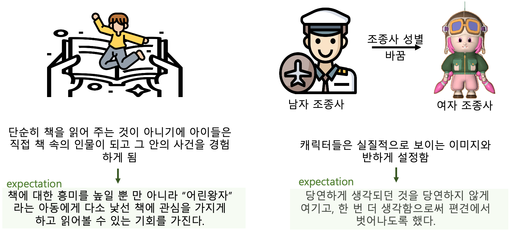

# 프로젝트 개요

|Category|explanation|
|:---------:|:---------:|
`동화` | 어린왕자   
`플렛폼` | VR스토리북   
`장르` | 롤플레이, 아케이드, 체감형 콘텐츠   
`대상` | 5~10세   
`설명` | B-612라는 행성에서 외롭게 지내던 어린 왕자는 어느 날 다른 행성의 구조 요청을 듣게 되고 친구 여우와 함께 위험에 빠진 행성을 구하기 위한 모험을 떠나며 시작된다. 공룡별과 사막별에서 다른 캐릭터들에게 도움을 주며 인터렉션이 진행된다. 미션이 수행되면 보상을 얻는다.

# 결과물 구성도

# Flow

# 콘텐츠 설명
|Scene|explanation1| explanation2
|:---------:|:---------:|:---------:|
처음 |  | 

|Scene|explanation
|:---------:|:---------:|
이동 | 

|Scene|explanation1| explanation2
|:---------:|:---------:|:---------:|
공룡별 |  | 

|Scene|explanation1| explanation2
|:---------:|:---------:|:---------:|
사막별 |  | 

|Scene|explanation
|:---------:|:---------:|
엔딩 | 

# 기대 효과

       

# 프로젝트 세팅 안내

## ⚠️ 안내 전 주의 사항

- ⚠️ 본 readme.md 파일은 꼭 정독 하시기 바랍니다.

- ⚠️ 정독 이후 readme.md 파일을 본인들의 프로젝트를 위한 내용으로 변경하시기 바랍니다.

- ⚠️ 다음 주 이후 부터는 해당 안내를 wiki로 동록하도록 하겠습니다. 
  (그 전에 다 읽으셨다면 삭제해도 괜찮습니다.

- ⚠️본 프로젝트는 교육을 위해 만들어진 프로젝트이며 이는 개인적으로 사용하실 수 없습니다. 프로젝트 파일에 대한 유출 및 오용시 책임은 개인에게 있습니다.

- **해당 내용 안내 했음에도 불구하고 반영되지 않거나 문제가 발생할 경우의 책임은 `해당 팀`에 있습니다.**

---

## ⚙️ 유니티 일반 설정 내용

### 1) Project Version

- 2021.3.11f1 LTS

- **주의사항**: 사용하는 Unity3D Project 버전이 서로 상이할 경우 `git push` 시에 지속적으로 `projectsetting.json` 파일이 변경되며 이는 `commit conflic`로 이어질 수 있습니다. 주의해 주세요.

### 2) Build Target

- `Android`로 설정되어 있습니다.

- 마지막 빌드의 목표는 `Oculus Quest2`의 `Stand alone application`으로 구동 되는 것입니다.

- 만약 Build Target 내용이 작업자들마다 상이하다면 __**조장**께서는 꼭 해당 인원에게 빌드타겟을 맞춰 작업하도록 안내 하셔야 합니다.__

### 3) Graphic Setting

- `Scriptable Render Pipeline`: `Universal Render Pipeline`

- `URP`에 대한 안내: [가이드 문서]([Universal Render Pipeline overview | Universal RP | 12.1.7](https://docs.unity3d.com/Packages/com.unity.render-pipelines.universal@12.1/manual/index.html))

- 그래픽 세팅은 절대 변경하지 마십시오!!!
  
  - Android 빌드시에 필요 사항을 충족한 세팅입니다. 변경을 해야 할 경우 꼭 사전에 알려주시기 바랍니다.

---

## 📚 사용 라이브러리/프레임워크

### 1) VR Framework

- `VRIF: VR Interaction Framework`를 기본 xr 프레임워크로 사용하고 있습니다.
  
  - 해당 프레임워크의 설명서: [위키 페이지 가기](https://wiki.beardedninjagames.com/)
  - BNG 폴더 내에 Sample Scene이 있습니다. 이를 참고하여 개발 하는 것을 추천합니다.

### 2) Shader

- 본 프로젝트는 `Universal Render Pipeline(URP)`로 설정되어 있습니다. `Standard Shader`(Standard Render Pipeline 에서 사용하는 기본 셰이더) 셰이더는 작동하지 않습니다. 따라서 `URP` > `Lit` 셰이더를 이용해야 합니다.

- `Toony Toon Shader2` : 기본 Lit 셰이더에서는 Toon Shading 기능을 제공하지 않습니다. 유아용 어플리케이션을 개발하는 만큼 가장 많이 사용할 수 있을 것으로 예상하는 툰 셰이더 에셋을 추가하였습니다.
  
  - 자세한 안내: [Toony Colors Pro 2](https://jeanmoreno.com/unity/toonycolorspro/) 참고 하세요.

### 3) TextMeshPro Animation

- 텍스트 애니메이션 도구입니다.

- [Text Animator for Unity | Trailer - YouTube](https://youtu.be/LO3eRIytmfs)

---

## 🏗️ 기타 개발을 위한 안내

### 1) IDE 선택

- 개발 IDE가 통일 되는 것이 좋습니다만 필수 사항은 아닙니다.

- IDE는 코드 스타일을 통일하거나 작업 방향성을 맞추는데 좋은 역할을 하기 때문에 수업 시간에 안내 해드린 여러가지 IDE 중 본인들에게 적합하다고 생각되는 IDE를 선정하여 사용하여 주시기 바랍니다.

### 2) Oculus Developer Hub

- Oculus 개발자 허브를 이용하면 직접 Oculus Quest2 장비에 개발 중인 소프트웨어를 설치하여 테스트 해볼 수 있습니다.

- 또한 여러 개발 편의 기능을 제공하기 때문에 작업에 앞서 설치 하는 것을 추천합니다.

- Oculus Developer Hub(ODH) 설치: [설치 페이지](https://developer.oculus.com/downloads/unity/)
